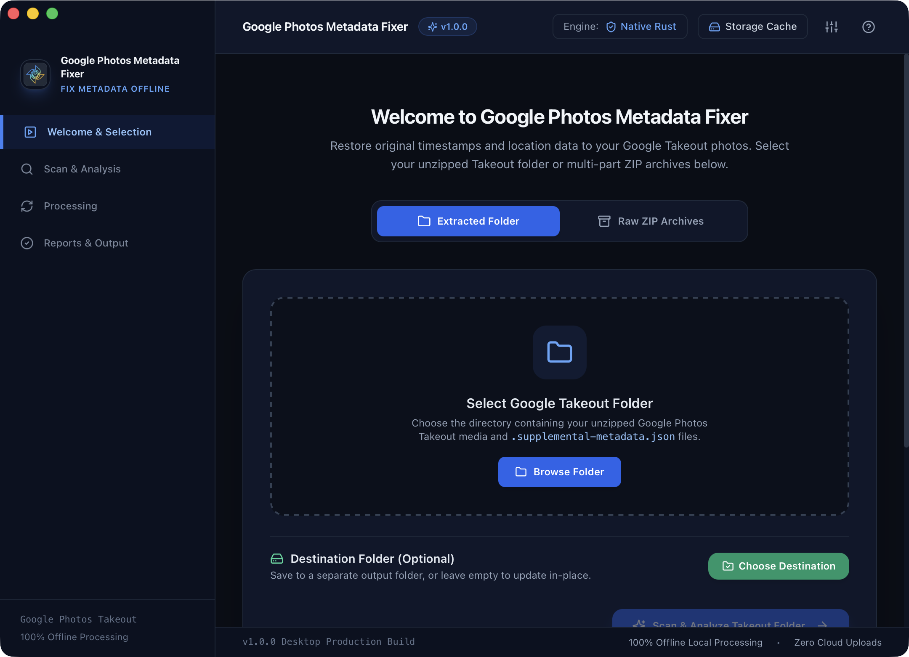

# 📸 Google Photos Metadata Fixer

[](https://github.com/)
[](https://tauri.app/)
[](https://www.rust-lang.org/)
[](https://react.dev/)
[](https://tailwindcss.com/)
[](https://github.com/)

A high-performance, cross-platform desktop application designed to stitch Google Photos Takeout metadata back directly into image and video files (**EXIF, IPTC, XMP**) and OS filesystem timestamps.

**100% offline, privacy-first, and runs locally on your machine with zero cloud uploads.**

<div align="center">
  <br />
  
  <br />
  <br />
</div>

---

## 🎯 The Problem

When you export your library via **Google Takeout**, Google strips metadata from the actual image/video files and places it in separate `.supplemental-metadata.json` sidecar files. When you import these photos into Apple Photos, Google Drive, Immich, or Windows Photos:

- ❌ All photos appear under **today's date** (the export date).
- ❌ **GPS locations** and altitudes are missing.
- ❌ **Descriptions, captions, and people tags** are lost.
- ❌ **Numbered duplicates** (`IMG_1234(1).jpg`) and **truncated filenames** fail to pair with standard scripts.

## 💡 The Solution

**Google Photos Metadata Fixer** uses a multi-pass heuristic matcher and multi-threaded Rust stitching engine to restore everything seamlessly:

- ✅ Embeds original capture timestamps into EXIF `DateTimeOriginal`, `CreateDate`, QuickTime `CreationDate`, and OS filesystem creation (`ctime`) and modification (`mtime`) timestamps.
- ✅ Injects GPS coordinates (Latitude, Longitude, Altitude).
- ✅ Injects IPTC/XMP captions, descriptions, and people tags.
- ✅ Handles Apple Live Photos and Motion Photos (`.heic` + `.mov` pairs).
- ✅ Recovers timestamps directly from media filenames (e.g. `PXL_20230815_142301.jpg`, `Screenshot 2024-01-10 at 12.30.45.png`, `VID_20220101_*.mp4`) when JSON files are missing.

---

## ✨ Key Features

### 📁 1. Flexible Folder Organization Modes
- **Preserve Google Photos Folders (Default)**: Keeps your exact album and year directory hierarchy intact (e.g., `Photos from 2023`, `Trip to Japan`) and fixes photos directly within their original folders.
- **Organize by Date (`YYYY/MM`)**: Automatically sorts media into clean chronological year/month folders (e.g., `2023/08/`).
- **Flat Single Directory**: Consolidates all stitched media into a single root folder without subdirectories.

### 📦 2. Dual Ingestion Engine
- **Extracted Folder Mode**: Point directly to your unzipped Google Takeout folder.
- **Raw ZIP Archives Mode**: Select a folder containing multi-part archives (`takeout-*.zip`) or individual ZIP files. The app decompresses them to a temporary staging cache, stitches metadata, copies final media to your destination, and automatically purges the cache.

### ⚙️ 3. User-Configurable Dynamic Pattern Sandbox
- **Custom Sidecar Pattern Templates**: Configure dynamic JSON matching rules using template placeholders:
  - `{filename}`: Full media filename (e.g., `IMG_1234.jpg`)
  - `{stem}`: Filename without extension (e.g., `IMG_1234`)
  - `{ext}`: File extension (e.g., `jpg`, `mp4`)
  - `{num}`: Duplicate numbering index (e.g., `1` for `IMG_1234(1).jpg`)
  - `{base_stem}`: Base stem without numbering
- **Live Pattern Sandbox Tester**: Test sample filenames in real time in Settings to preview all generated candidate JSON sidecar names before running scans.
- **Custom Format Support**: Add new camera RAW extensions (`.cr3`, `.nef`, `.arw`, `.insv`, etc.) or ignored non-media JSON rules.

### 🪵 4. Local Persistent Diagnostic Logging
- Logs user interactions and backend processing events locally.
- **Standard OS Storage**:
  - **macOS**: `~/Library/Logs/Google Photos Metadata Fixer/`
  - **Windows**: `%LOCALAPPDATA%\Google Photos Metadata Fixer\logs\`
  - **Linux**: `~/.local/state/takeout-stitcher/logs/` (XDG State directory)
- Automatic per-run log rotation and cleanup with one-click **"Open Log Directory"** and **"Clear Logs"** in Settings.

---

## 🛠️ Tech Stack & Architecture

- **Desktop Framework**: [Tauri v2](https://v2.tauri.app/) (Lightweight, memory-safe Rust desktop runtime).
- **Backend**: Rust 2021, [Rayon](https://github.com/rayon-rs/rayon) (parallel data processing), `little_exif`, `kamadak-exif`, `filetime`, `chrono`, and optional `exiftool` integration.
- **Frontend**: [React 18](https://react.dev/), [TypeScript](https://www.typescriptlang.org/), [Tailwind CSS](https://tailwindcss.com/), [Vite](https://vitejs.dev/), [Lucide Icons](https://lucide.dev/).

```
google-photos-metadata-fixer/
├── .github/
│   └── workflows/
│       └── build.yml               # Automated Multi-Platform Release CI/CD
├── src/                            # React + TypeScript Frontend
│   ├── components/                 # UI Views & Components
│   │   ├── FolderSelector.tsx      # Ingestion (Folder vs ZIP archives) & Mode selector
│   │   ├── ScanSummary.tsx         # Scan & Match metrics inspection table
│   │   ├── OptionsPanel.tsx        # Metadata stitch toggles & layout settings
│   │   ├── ProgressDashboard.tsx   # Live Rayon progress & ETA dashboard
│   │   ├── LogViewer.tsx           # Real-time event logger with CSV export
│   │   ├── CompletedView.tsx       # Summary report & destination launcher
│   │   ├── SettingsModal.tsx       # Pattern sandbox, formats & diagnostic logs
│   │   ├── StorageManagerModal.tsx # Staging cache analyzer & disk purge
│   │   ├── PreviewModal.tsx        # Pre-flight metadata inspector
│   │   ├── Header.tsx              # System status & quick actions
│   │   └── Sidebar.tsx             # Workflow step navigation
│   ├── types/                      # TypeScript data transfer models
│   │   └── takeout.ts
│   ├── utils/                      # Frontend logging & telemetry bridge
│   │   └── logger.ts
│   ├── App.tsx                     # Main state machine
│   ├── main.tsx                    # React DOM entrypoint
│   └── index.css                   # Tailwind theme & animation styles
├── src-tauri/                      # Native Rust Backend
│   ├── src/
│   │   ├── main.rs                 # Desktop binary entrypoint
│   │   ├── lib.rs                  # Tauri commands & Cocoa/OS lifecycle
│   │   ├── matcher.rs              # Heuristic JSON sidecar matcher
│   │   ├── parser.rs               # Google Takeout JSON schema parser
│   │   ├── date_extractor.rs       # Media filename timestamp recovery regexes
│   │   ├── extractor.rs            # Multi-part ZIP stream extractor & staging
│   │   ├── config.rs               # Persistent config loader & template interpolator
│   │   ├── diagnostics.rs          # Cross-platform OS logger & hardware detection
│   │   ├── processor.rs            # Parallel Rayon batch pipeline & event broadcaster
│   │   └── stitcher/               # Metadata writing engines
│   │       ├── mod.rs
│   │       ├── exif_writer.rs      # Native EXIF & ExifTool fallback writer
│   │       ├── video_writer.rs     # QuickTime & MP4 atom metadata writer
│   │       └── filetime_util.rs    # OS creation & modification timestamp synchronizer
│   ├── icons/                      # macOS ICNS, Windows ICO, and Linux PNG icons
│   ├── Info.plist                  # macOS Application Bundle definition
│   ├── Cargo.toml                  # Rust dependencies & metadata
│   └── tauri.conf.json             # Tauri configuration & window security
├── package.json
├── tailwind.config.js
├── vite.config.ts
└── tsconfig.json
```

---

## 💻 Developer Setup & Local Development

### 1. Prerequisites

Ensure you have the following installed on your machine:
- **Node.js** (v18.0 or higher) - [Download Node.js](https://nodejs.org/)
- **Rust & Cargo** (v1.77 or higher) - [Install Rust](https://www.rust-lang.org/tools/install):
  ```bash
  curl --proto '=https' --tlsv1.2 -sSf https://sh.rustup.rs | sh
  ```

#### OS-Specific Build Dependencies:
- **macOS**: Xcode Command Line Tools:
  ```bash
  xcode-select --install
  ```
- **Linux (Debian / Ubuntu)**:
  ```bash
  sudo apt update
  sudo apt install -y libwebkit2gtk-4.1-dev libappindicator3-dev librsvg2-dev patchelf libssl-dev libgtk-3-dev
  ```
- **Windows**: [Microsoft C++ Build Tools](https://visualstudio.microsoft.com/visual-cpp-build-tools/) or Visual Studio with Desktop development with C++.

---

### 2. Clone the Repository

```bash
# Clone your fork
git clone https://github.com/<your-username>/google-photos-metadata-fixer.git
cd google-photos-metadata-fixer

# Install frontend dependencies
npm install
```

---

### 3. Run in Development Mode

To launch the desktop application with Hot-Module Replacement (HMR) and live Rust rebuilds:

```bash
npm run tauri dev
```

---

### 4. Running Tests & Quality Checks

Run the automated test suite before submitting changes:

```bash
# 1. Test frontend TypeScript & build
npm run build

# 2. Test Rust unit tests & matcher heuristics
cd src-tauri
cargo test

# 3. Rust compiler & linter checks
cargo check
cargo clippy
```

---

## 📦 Building Standalone Production Installers

To compile optimized release binaries for your current operating system:

```bash
npm run tauri build
```

The compiled bundles will be generated under `src-tauri/target/release/bundle/`:
- **macOS**: `.dmg` installer & standalone `.app` bundle.
- **Windows**: `.msi` Windows installer & `.exe` setup.
- **Linux**: `.AppImage` (runs anywhere without installation) & `.deb` package.

---

## 🚀 Releasing & Multi-Platform CI/CD with GitHub Actions

The repository includes a ready-to-use GitHub Actions workflow (`.github/workflows/build.yml`) that automatically builds and publishes native installers for **macOS (Universal Apple Silicon + Intel)**, **Windows (x64)**, and **Linux (x64)**.

### Creating a New Release:

1. Ensure the versions are in sync across:
   - `package.json` (`"version": "1.0.0"`)
   - `src-tauri/Cargo.toml` (`version = "1.0.0"`)
   - `src-tauri/tauri.conf.json` (`"version": "1.0.0"`)
2. Push a git release tag:
   ```bash
   git add .
   git commit -m "Release v1.0.0"
   git tag v1.0.0
   git push origin main --tags
   ```
3. GitHub Actions will automatically:
   - Spin up `macos-latest`, `windows-latest`, and `ubuntu-22.04` build runners in parallel.
   - Compile and package `.dmg`, `.msi`, `.exe`, `.AppImage`, and `.deb` installers.
   - Publish a new **GitHub Release** with all download assets attached.

---

## 🤝 Contributing

We welcome contributions from the community! Here is how you can help:

1. **Fork the Repository** on GitHub.
2. **Create a Feature Branch**:
   ```bash
   git checkout -b feature/awesome-new-feature
   ```
3. **Commit your Changes**:
   ```bash
   git commit -m "Add support for .insv 360 video format metadata"
   ```
4. **Push to your Branch**:
   ```bash
   git push origin feature/awesome-new-feature
   ```
5. **Open a Pull Request** describing your changes and testing performed.

---

## 📄 License

This project is licensed under the **MIT License**. See the `LICENSE` file for details.
